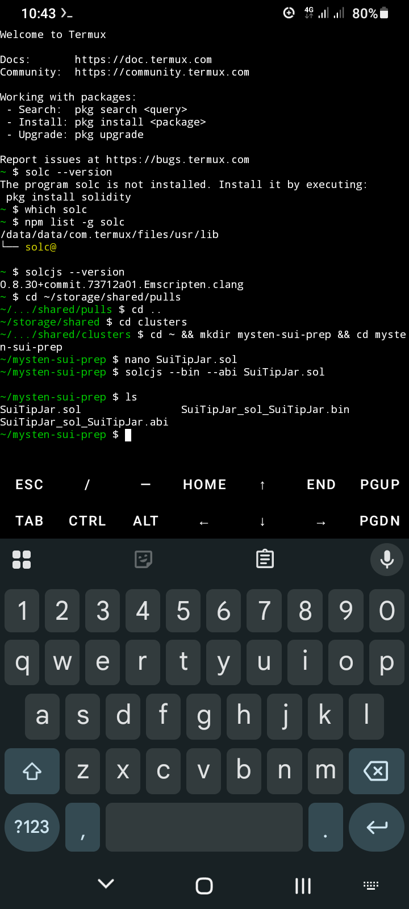

# SuiTipJar - Solidity on Termux Android

> Compiling and deploying Web3 contracts from a mobile terminal in Harare, Zimbabwe 🇿🇼  
> Building toward Rust/Sui Move for Mysten Labs ecosystem

Proof of Work

**Environment**: Termux on Android, no laptop needed

```bash
$ solcjs --version
0.8.30+commit.73712a01.Emscripten.clang

$ solcjs --bin --abi SuiTipJar.sol
$ ls
SuiTipJar.sol    SuiTipJar_sol_SuiTipJar.bin    SuiTipJar_sol_SuiTipJar.abi
```

*Screenshot from Termux:*


What it does

`SuiTipJar.sol` is a simple donation contract demonstrating:
1. *Payable functions* - `tip()` accepts native token
2. *Access control* - `withdraw()` restricted to deployer 
3. *Events* - `Tipped(address, amount)` for indexing
4. *Sui alignment* - `MISSION` constant signals target ecosystem
